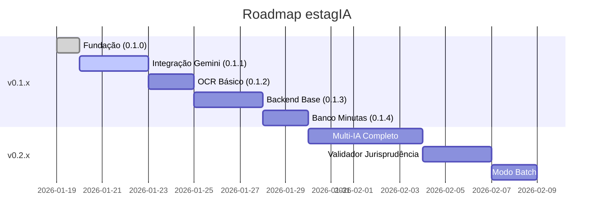

# Plano de Implementação - estagIA

> **Documento de referência para equipe de desenvolvimento**  
> **Última atualização**: 19/01/2026

---

## 📋 Sumário

1. [Visão Geral do MVP](#visão-geral-do-mvp)
2. [Fases de Implementação](#fases-de-implementação)
3. [Fase 1: Fundação (v0.1.x)](#fase-1-fundação-v01x)
4. [Fase 2: Integração IA (v0.1.x continuação)](#fase-2-integração-ia-v01x-continuação)
5. [Fase 3: Backend (v0.1.x final)](#fase-3-backend-v01x-final)
6. [Fase 4: Multi-IA Completo (v0.2.x)](#fase-4-multi-ia-completo-v02x)
7. [Critérios de Aceite](#critérios-de-aceite)
8. [Arquivos por Funcionalidade](#arquivos-por-funcionalidade)

---

## 🎯 Visão Geral do MVP

### Objetivo

Criar um assistente funcional que:
1. Receba insumos processuais (texto e arquivos)
2. Processe via pipeline multi-IA
3. Gere minutas de decisão no estilo do magistrado
4. Opcionalmente gere prompts para uso externo

### Princípios de Desenvolvimento

1. **Documentação First**: Toda alteração deve ser registrada em CHANGELOG.md
2. **Versionamento Incremental**: 0.1.0 → 0.1.1 → 0.1.2... (0.2.x apenas com autorização)
3. **Anti-Alucinação**: Prioridade máxima na confiabilidade
4. **Contexto Integral**: Preferir entrada grande sobre chunking

---

## 📊 Fases de Implementação



---

## 🔧 Fase 1: Fundação (v0.1.x)

### Status: ✅ CONCLUÍDO (v0.1.0)

### Entregáveis

| Item | Status | Descrição |
|---|---|---|
| Estrutura React + Vite | ✅ | Projeto base configurado |
| TypeScript | ✅ | Tipos definidos |
| Layout 4 Colunas | ✅ | UI responsiva |
| Estado Zustand | ✅ | Gerenciamento global |
| 8 Matérias | ✅ | Cards configurados |
| Pipeline Simulado | ✅ | Mock do fluxo |
| Documentação | ✅ | Blueprint, Changelog, Implementation Plan |

### Alterações Imediatas (v0.1.0)

#### 1. Atualizar porta para 3008

**Arquivo**: `vite.config.ts`
```typescript
server: {
  port: 3008,  // Alterado de 3000
  host: '0.0.0.0',
},
```

#### 2. Atualizar versão no package.json

**Arquivo**: `package.json`
```json
"version": "0.1.0"
```

#### 3. Atualizar versão no Header

**Arquivo**: `components/Header.tsx`
```tsx
<span>v0.1.0</span>  // Alterado de v1.0 MVP
```

#### 4. Integrar Logo oficial

**Arquivo**: `components/Header.tsx`
- Substituir ícone Gavel pelo Logo.svg

---

## 🤖 Fase 2: Integração IA (v0.1.x continuação)

### Status: 📋 PLANEJADO

### v0.1.1 - Integração Gemini

**Objetivo**: Primeira integração real com IA

**Tarefas**:

1. **Configurar variáveis de ambiente**
   ```env
   GEMINI_API_KEY=...
   ```

2. **Criar serviço Gemini**
   - **Arquivo**: `services/gemini.ts`
   - Função: `generateDecision(inputs, guidance)`
   - Retorno: Texto da decisão

3. **Integrar ao pipeline**
   - **Arquivo**: `services/pipeline.ts`
   - Substituir mock por chamada real

4. **Adicionar tratamento de erros**
   - Loading states
   - Mensagens de erro
   - Retry logic

### v0.1.2 - OCR Básico

**Objetivo**: Extrair texto de PDFs e imagens

**Tarefas**:

1. **Criar serviço OCR**
   - **Arquivo**: `services/ocr.ts`
   - Função: `extractText(file)`
   - Engines: Gemini Vision (primário)

2. **Atualizar ColumnInputs**
   - Processar uploads automaticamente
   - Mostrar texto extraído
   - Indicar confiança

3. **Criar modal de visualização**
   - **Arquivo**: `components/modals/OcrPreviewModal.tsx`
   - Mostrar texto extraído
   - Permitir edição

---

## 🖥️ Fase 3: Backend (v0.1.x final)

### Status: 📋 PLANEJADO

### v0.1.3 - Backend FastAPI

**Objetivo**: Mover lógica de IA para backend seguro

**Estrutura**:
```
backend/
├── app/
│   ├── main.py           # FastAPI app
│   ├── routers/
│   │   ├── generate.py   # /api/generate
│   │   ├── ocr.py        # /api/ocr
│   │   └── minutas.py    # /api/minutas
│   ├── services/
│   │   ├── pipeline.py   # Pipeline multi-IA
│   │   ├── ocr_engine.py # OCR multi-engine
│   │   └── providers/    # OpenAI, Anthropic, etc.
│   └── models/
│       └── schemas.py    # Pydantic models
├── requirements.txt
└── .env
```

**Endpoints**:
```
POST /api/generate     - Gerar decisão
POST /api/ocr          - Extrair texto de arquivo
GET  /api/minutas      - Listar minutas
POST /api/minutas      - Cadastrar minuta
```

### v0.1.4 - Banco de Minutas

**Objetivo**: Estrutura para armazenar decisões

**Tarefas**:

1. **Configurar Supabase**
   - Criar projeto
   - Configurar auth
   - Criar tabelas

2. **Tabelas SQL**
   ```sql
   -- minutas
   CREATE TABLE minutas (
     id UUID PRIMARY KEY DEFAULT gen_random_uuid(),
     user_id UUID REFERENCES auth.users(id),
     materia VARCHAR(100),
     versao_assinada TEXT,
     tags TEXT[],
     exemplar BOOLEAN DEFAULT FALSE,
     created_at TIMESTAMPTZ DEFAULT NOW()
   );
   ```

3. **Criar modal de Banco de Minutas**
   - **Arquivo**: `components/modals/MinutasModal.tsx`
   - Listagem com busca
   - Cadastro de nova minuta
   - Visualização

---

## 🔗 Fase 4: Multi-IA Completo (v0.2.x)

### Status: 📋 PLANEJADO (aguardando autorização)

### Tarefas

1. **Pipeline completo**
   - GPT-4 (extração)
   - Perplexity (coerência)
   - Gemini (validação)
   - Grok (verificação)
   - Claude (redação)

2. **Validador de Jurisprudência**
   - Regex para citações
   - Busca em stf.jus.br
   - Busca em stj.jus.br
   - Rejeição de citações não verificadas

3. **Modo Batch**
   - Upload de planilha
   - Processamento em fila
   - Exportação de resultados

4. **Autenticação completa**
   - Login Supabase
   - Perfis de usuário
   - RLS nas tabelas

---

## ✅ Critérios de Aceite

### v0.1.x (MVP)

| Critério | Descrição |
|---|---|
| Interface funcional | 4 colunas renderizando corretamente |
| Geração básica | Pelo menos 1 IA gerando decisão |
| OCR funcional | Extrair texto de PDF simples |
| Porta 3008 | Servidor rodando na porta correta |
| Documentação | Todos os docs atualizados |

### v0.2.x

| Critério | Descrição |
|---|---|
| Pipeline completo | 5 IAs funcionando em sequência |
| Anti-alucinação | Sistema de validação ativo |
| Jurisprudência | Verificador funcional |
| Batch | Processar múltiplos casos |
| Auth | Login funcionando |

---

## 📁 Arquivos por Funcionalidade

### Layout e UI

| Arquivo | Propósito |
|---|---|
| `App.tsx` | Layout principal |
| `components/Header.tsx` | Navegação |
| `components/ColumnMatters.tsx` | Seleção de matéria |
| `components/ColumnInputs.tsx` | Entrada de dados |
| `components/ColumnGuidance.tsx` | Orientações |
| `components/ColumnOutput.tsx` | Saída |
| `index.html` | HTML base + Tailwind |
| `index.css` | Estilos customizados |

### Estado e Tipos

| Arquivo | Propósito |
|---|---|
| `store.ts` | Estado global Zustand |
| `types.ts` | Tipos TypeScript |
| `constants.ts` | Matérias, perfis |

### Serviços

| Arquivo | Propósito |
|---|---|
| `services/pipeline.ts` | Orquestração do pipeline |
| `services/gemini.ts` | Integração Gemini (planejado) |
| `services/ocr.ts` | Extração OCR (planejado) |

### Configuração

| Arquivo | Propósito |
|---|---|
| `vite.config.ts` | Configuração Vite |
| `package.json` | Dependências |
| `tsconfig.json` | TypeScript |
| `.env.local` | Variáveis de ambiente |

### Documentação

| Arquivo | Propósito |
|---|---|
| `docs/BLUEPRINT.md` | Visão geral do projeto |
| `docs/CHANGELOG.md` | Histórico de versões |
| `docs/IMPLEMENTATION_PLAN.md` | Este documento |

---

## 🚀 Comandos de Desenvolvimento

```bash
# Instalar dependências
npm install

# Rodar em desenvolvimento (porta 3008)
npm run dev

# Build de produção
npm run build

# Preview do build
npm run preview
```

---

## 📝 Registro de Alterações

Toda alteração deve:

1. **Atualizar CHANGELOG.md** com descrição detalhada
2. **Incrementar versão** em package.json (0.1.x)
3. **Atualizar Header** se versão mudar visualmente
4. **Documentar** qualquer nova funcionalidade

---

*Este documento é atualizado a cada release.*
